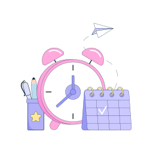

### Hi there 👋

<h1 align="center">¡Hola, soy Magenta Paredes!</h1>

  
  
  

Ilustración por <a href="https://icons8.com/illustrations/author/7WmtYU90j36d">Fruzka</a> de <a href="https://icons8.com/illustrations">Ouch!</a>

<!--
**Meowwuw/Meowwuw** is a ✨ _special_ ✨ repository because its `README.md` (this file) appears on your GitHub profile.

Here are some ideas to get you started:

- 🔭 I’m currently working on ...
- 🌱 I’m currently learning ...
- 👯 I’m looking to collaborate on ...
- 🤔 I’m looking for help with ...
- 💬 Ask me about ...
- 📫 How to reach me: ...
- 😄 Pronouns: ...
- ⚡ Fun fact: ...
-->
